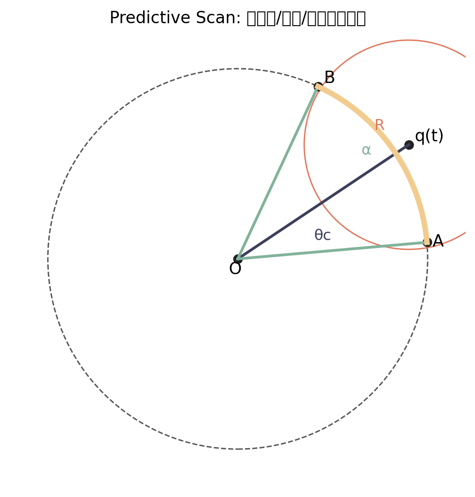

# Predictive Scan Avoidance

该算法会在预测时间 $t$ 内扫描一组候选角度，并对每个角度预测未来位置是否会与检测圈内的单位发生碰撞。发生碰撞的角度会被屏蔽，最终从可用角度中选择与目标方向最接近的角度。

## 配置入口

集中配置文件：`avoidance_config.py` 中的 `AVOIDANCE_CONFIG["predictive_scan"]`。

关键参数说明：
- `prediction_time`：预测时间 $t$
- `detection_radius_factor`：检测半径因子，检测半径 = 速度 × $t$ × 因子
- `angle_step_deg`：角度采样步长（仅用于 Debug 可视化采样，不参与避障计算）
- `collision_padding`：碰撞安全边距
- `angle_selection_method`：角度选择算法（在配置中切换）
- `fallback_method`：无可用角度时的回退策略

`angle_selection_method` 支持：
- `closest_to_target`
- `closest_to_current`
- `weighted_target_current`

## 接入方式

算法文件：`avoidance_predictive.py`。运行 `test.py` 时会自动被 `avoidance_manager` 加载并出现在算法列表中。

并行版本：`avoidance_predictive_parallel.py`（算法名：`Predictive Scan (Parallel)`）。
可通过配置 `parallel_workers` 设置线程数，`0` 表示使用 CPU 核心数（上限 32）。

向量化版本：`avoidance_predictive_vectorized.py`（算法名：`Predictive Scan (Vectorized)`）。
该版本使用 NumPy 对时间采样进行批处理计算；若未安装 NumPy，会自动退回到普通实现。

## 快速验证

运行 `test_predictive_scan.py` 可进行最小验证。

## 参数方程与固定 $t$ 的角度区间推导

以下推导对应 `avoidance_predictive.py` 中 `_get_blocked_intervals` 的几何计算，目标是在固定预测时间 $t$ 时，求会发生碰撞的角度区间（即阻塞角区间）。

### 1) 相对运动参数方程

设当前单位为原点，邻居单位在 $t=0$ 的相对位置为 $p_0$，邻居速度向量为 $v_o$，自身速度大小为 $v_s$，候选朝向角为 $\theta$：

- 初始相对位置：

$$
p_0 = (p_{x0}, p_{y0}) = (x_{other} - x_{self},\; y_{other} - y_{self})
$$

- 邻居速度向量：

$$
v_o = (v_{ox}, v_{oy}) = v_{other}(\cos\phi, \sin\phi)
$$

- 组合半径（含安全边距）：

$$
R = r_{self} + r_{other} + padding
$$

固定时间 $t$ 时：

- 邻居的相对位置：

$$
q(t) = p_0 + v_o t = (q_x, q_y)
$$

- 自身在朝向 $\theta$ 的位置：

$$
s(t,\theta) = v_s t(\cos\theta, \sin\theta)
$$

### 2) 碰撞条件

碰撞条件为两者距离小于等于 $R$：

$$
\|q(t) - s(t,\theta)\| \le R
$$

展开为显式参数方程：

$$
\left(q_x - v_s t\cos\theta\right)^2 + \left(q_y - v_s t\sin\theta\right)^2 \le R^2
$$

### 3) 固定 $t$ 的角度区间（解析解）

记：

$$
d = \|q(t)\|,\qquad r = v_s t
$$

当两圆可相交时：

$$
|r - R| \le d \le r + R
$$

则可行角度区间为：

- 区间中心角：

$$
	heta_c = \operatorname{atan2}(q_y, q_x)
$$

- 半角：

$$
\alpha = \arccos\left(\frac{d^2 + r^2 - R^2}{2dr}\right)
$$

- 阻塞角区间：

$$
	heta \in [\theta_c - \alpha,\; \theta_c + \alpha]
$$

### 4) 边界情况说明

- 若 $d > r + R$：两圆不相交，无阻塞角度。
- 若 $d < |r - R|$：一圆完全包含另一圆。
	- 当 $R \ge r + d$ 时，所有角度都会碰撞（全阻塞）。
	- 其余情况下无交集（无阻塞）。

> 代码中的 `center_angle` 对应 $\theta_c$，`half_angle` 对应 $\alpha$，这正是上述解析式的实现。

### 5) 几何示意图（中心角 / 半角 / 阻塞区间）

下图是概念示意（非比例尺），用于说明中心角 $\theta_c$、半角 $\alpha$ 与阻塞角区间的关系。

